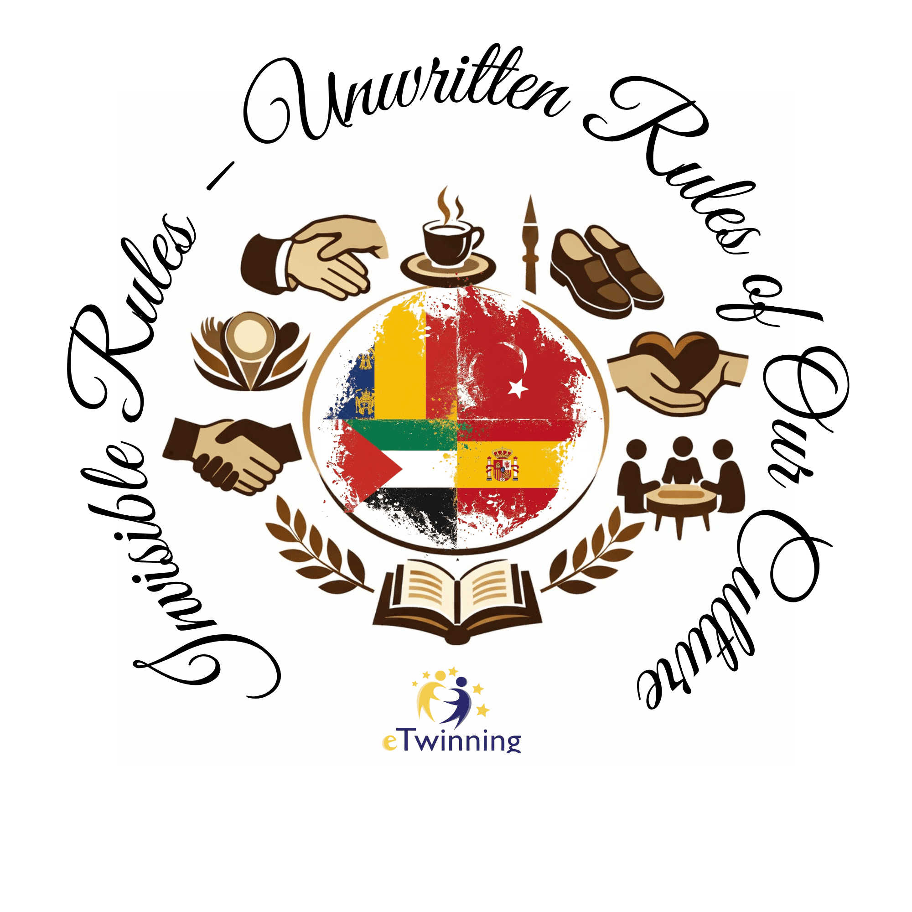
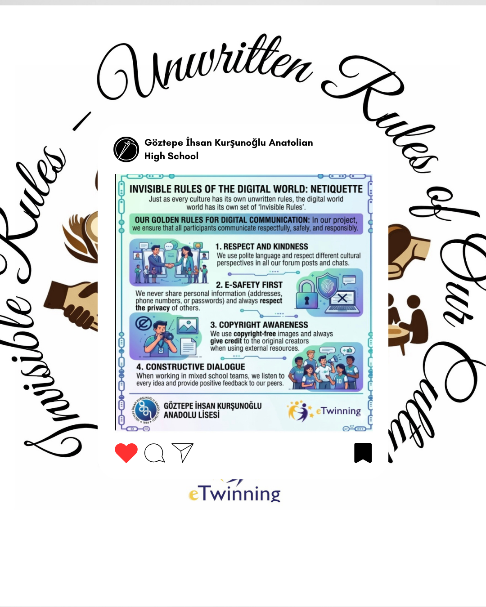
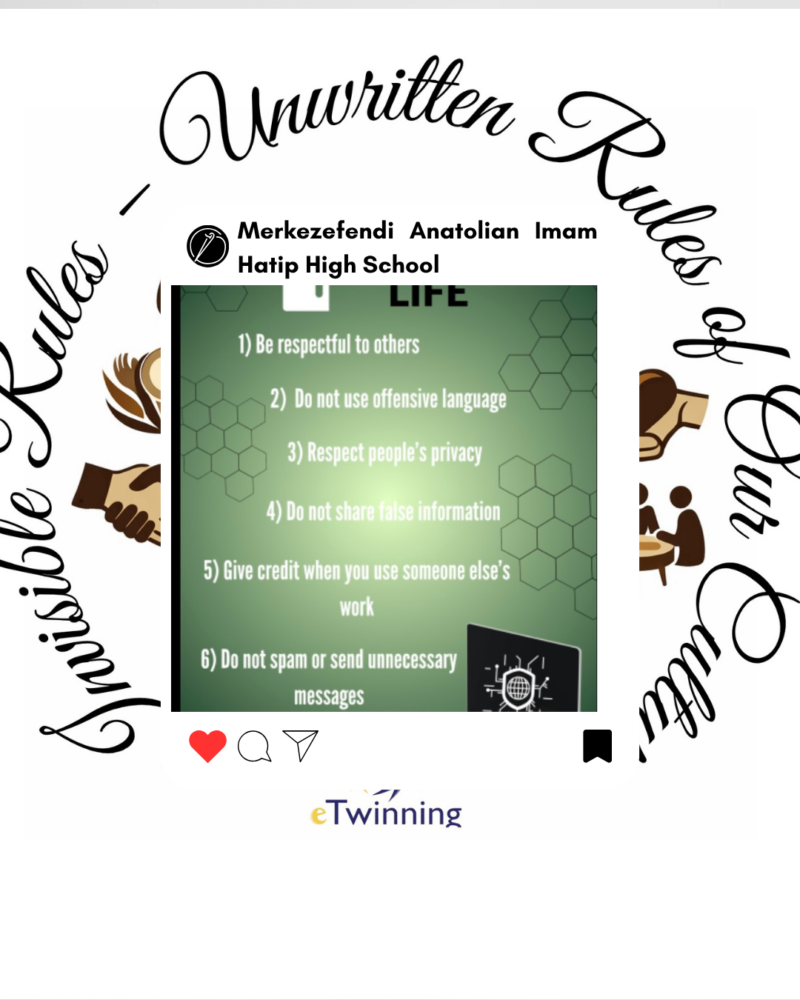
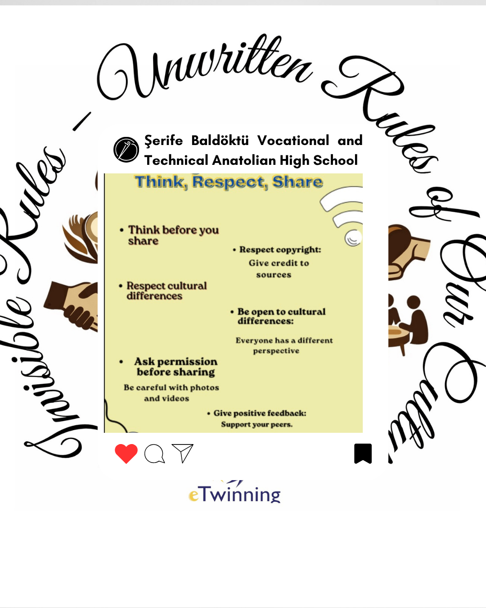
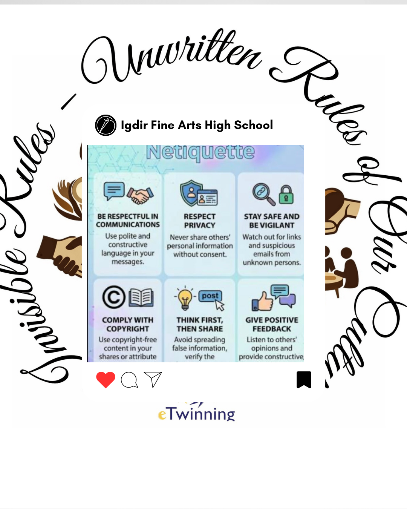
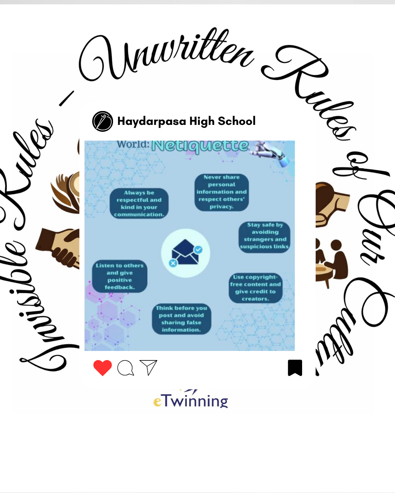
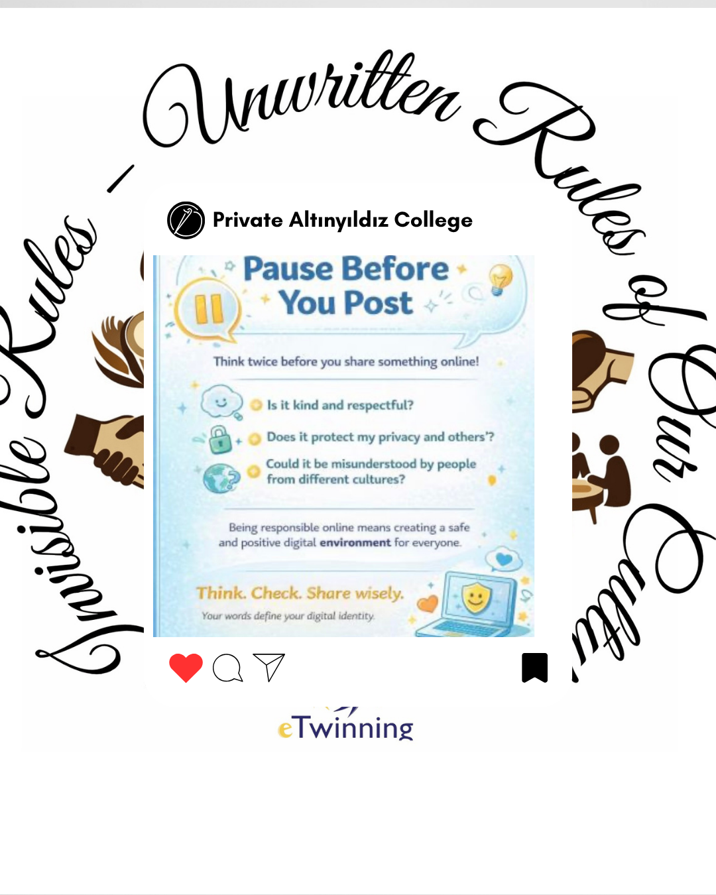
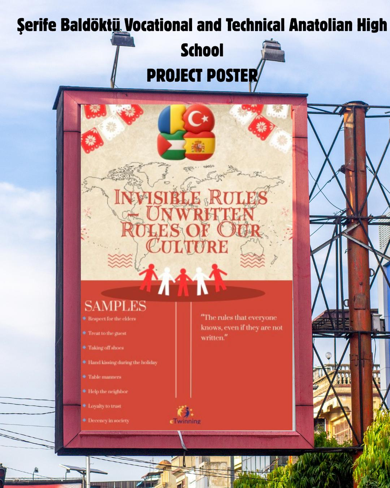
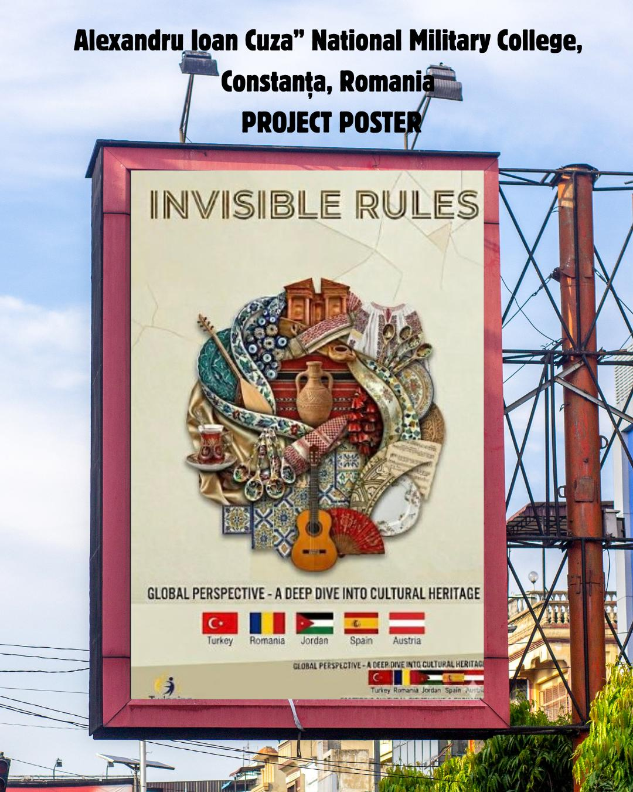

  

# Invisible Rules: The Unwritten Rules of Our Culture
This international project invites students to explore the deep-seated cultural norms and unwritten social rules that shape daily life across different communities. By uncovering these "invisible rules," participants gain a deeper understanding of cultural diversity and the subtle logic behind social behaviors worldwide.
# Student Introductions

## Turkey
- **Cansu Ergül (Founder)**  
  Iğdır Fine Arts High School — Iğdır  
- **Mediha Tabak (Administrator)**  
  Haydarpaşa High School — Istanbul (Üsküdar)  
- **Ayşegül Karapınar Arif**  
  Private Muğla Modern Sciences Academy Science High School — Muğla  
- **Fatma Sadife Isleyen**  
  Zeytinburnu Merkezefendi Anatolian Imam Hatip High School — Istanbul (Zeytinburnu)  
- **Hanife Pertek**  
  Bahçelievler Aka College — Istanbul (Bahçelievler)  
- **Emine Mutlu Köse**  
  Şerife Baldöktü Vocational and Technical Anatolian High School — Istanbul (Silivri)  
- **Ayşe Demircan**  
  Eskişehir Girls Anatolian Imam Hatip High School — Eskişehir  
- **Cansu Aydın Kurt**  
  TEV İnanç Türkeş Private High School — Kocaeli (Gebze)  
- **Pınar Kahraman**  
  Göztepe İnsan Kurşunoğlu Anatolian High School — Istanbul (Kadıköy)  
- **Senanur Babuşcu**  
  Private Altınyıldız Educational Institutions — Nevşehir (Merkez)  
## Romania
- **Daniela Mocanu (Co-founder)**  
  Colegiul National Militar „Alexandru Ioan Cuza” — Constanța  
- **Claudia Hritcu**  
  Colegiul National Militar „Alexandru Ioan Cuza” — Constanța  
## Jordan
- **Audai Alzgool**  
  Anjara Comprehensive Secondary School for Boys — Anjara  
## Spain
- **María Martín Bullón**  
  IES Río Cuerpo de Hombre — Béjar  

## 🖼️ Project Gallery & Dissemination Materials

Below are the digital assets and activity outputs developed for our international projects:

| | | |
| :---: | :---: | :---: |
|  |  |  |
| **Project Design I** | **Project Design II** | **Project Design III** |
|  |  |  |
| **Activity Output I** | **Activity Output II** | **Activity Output III** |

> *All visual materials are created as part of our school's eTwinning  dissemination activities.*

## 📸 Project Implementation & Activity Photos

This section showcases the live implementation of our project activities and collaborative student workshops.

| | |
| :---: | :---: |
|  |  |
| *Workshop Session I* | *Student Collaboration* |
|  |  |
| *Activity Highlights* | *In-Class Implementation* |
|  |  |
| *Interactive Learning* | *Group Work* |

> *Note: All photos represent the active participation of students and teachers in our international project framework.*

## 🖼️ Visual Evidence
| Project Activity Snapshot |
| :---: |
|  |

